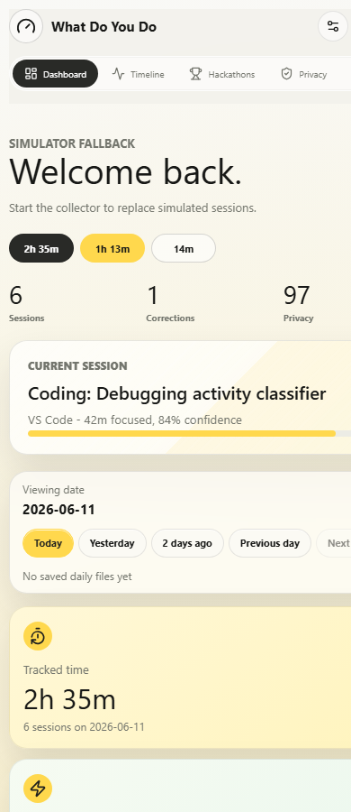

# What Do You Do

Privacy-first activity intelligence for desktop and mobile. The app helps a user understand what they actually did across the day: coding, researching, browsing, gaming, Discord, learning, idle time, hackathon work, reminders, notes, and AI-agent-assisted productivity.

Everything is designed around a local-first rule: raw activity stays on the user's devices, and only approved summaries can be shared with the companion AI agent.

## Demo

<table>
  <tr>
    <td colspan="2">
      
    </td>
  </tr>
  <tr>
    <td width="50%">
      
    </td>
    <td width="50%">
      
    </td>
  </tr>
</table>

## Highlights

- Premium glass dashboard with light and dark mode
- Live local Windows activity collector for foreground app and idle state
- Dynamic daily dashboard backed by persisted local session files
- Activity timeline with top detected contexts and deeper logs
- Local correction flow for better labels over time
- Project AI Agent / AiOS bridge for approved wellbeing summaries
- Hackathon Corner for timelines, applied dates, deadlines, plans, work logs, and source inbox updates
- Desktop and mobile widget previews
- Tauri desktop app wrapper
- Privacy controls that make the data boundary visible

## Local Architecture

```text
Windows desktop signals
        |
        v
Local activity collector
        |
        v
data/*.json session store  --->  React dashboard
        |                              |
        |                              v
        |                       corrections, notes,
        |                       widgets, hackathons
        v
optional approved summaries
        |
        v
Project AI Agent / AiOS
```

The dashboard can run without AiOS. When AiOS is installed and unlocked locally, `What Do You Do` can sync high-level summaries to the agent through the local API.

## Quick Start

```powershell
npm install
npm run dev
```

Run the local collector in a second terminal:

```powershell
npm run collector:dev
```

Build the web app:

```powershell
npm run build
```

Run the desktop wrapper:

```powershell
npm run desktop:dev
npm run desktop:build
```

The desktop commands require Rust/Cargo and Visual Studio Build Tools. See [desktop build notes](projects/desktop-build-notes.md).

## AiOS Assistant Bridge

`What Do You Do` connects to the local AiOS Assistant at `http://127.0.0.1:5000`.

Workflow:

1. Start AiOS Assistant from `C:\Users\anura\Documents\Ai Agent`.
2. Unlock AiOS in the browser if the local PIN is enabled.
3. Start this app and the collector with `npm run dev` and `npm run collector:dev`.
4. Open the `Project AI Agent` panel and press `Connect`.
5. Press `Sync` to send new high-level activity sessions to AiOS.
6. Optionally enable `Auto-sync approved summaries` after the connection is verified.

Bridge controls:

- `AiOS API`: editable local backend URL, stored in browser local storage.
- `Pending sync`: count of local sessions not yet sent to AiOS.
- `Auto-sync approved summaries`: opt-in background sync while the dashboard is open.
- `Reset sent list`: clears the local duplicate guard so current sessions can be sent again.

Optional background sync from the collector:

```powershell
$env:WDYD_AIOS_SYNC='1'
$env:WDYD_AIOS_URL='http://127.0.0.1:5000'
$env:WDYD_AIOS_API_TOKEN='paste-the-token-from-aios-settings'
npm run collector:dev
```

When enabled, the collector syncs closed sessions in the background and stores duplicate protection in `data/aios-sync-state.json`.

## Privacy Boundary

The bridge sends only approved summary fields:

- app name
- broad category
- sub-activity label
- start and end time label
- duration in minutes

It does not send screenshots, keystrokes, raw window titles, private messages, browser history, files, or full notes.

## Hackathon Corner

The Hackathon Corner combines:

- a four-stage local board: Watching, Applied, Building, Submitted
- manual plans, progress, work logs, deadlines, and timeline entries
- a live AiOS source inbox for Gmail and platform updates
- unread update controls
- connector health and manual `Scan now`
- one-click addition of discovered hackathons to the local build board

The source inbox polls `GET http://127.0.0.1:5000/api/hackathons` and `GET http://127.0.0.1:5000/api/placements` every 30 seconds. AiOS performs the Gmail/platform monitoring, keeping credentials and source processing out of the wellbeing UI.

Each hackathon stores its applied date, deadline, progress percentage, plan, work completed, URL, and dated timeline updates in `data/hackathons.json`.

Local API:

```text
GET  /hackathons
POST /hackathons/save
POST /hackathons/timeline
POST /hackathons/delete
```

## Project Docs

- [Project brief](projects/what-do-you-do.md)
- [Architecture](projects/architecture.md)
- [Local collector notes](projects/local-collector-notes.md)
- [Real data pipeline](projects/real-data-pipeline.md)
