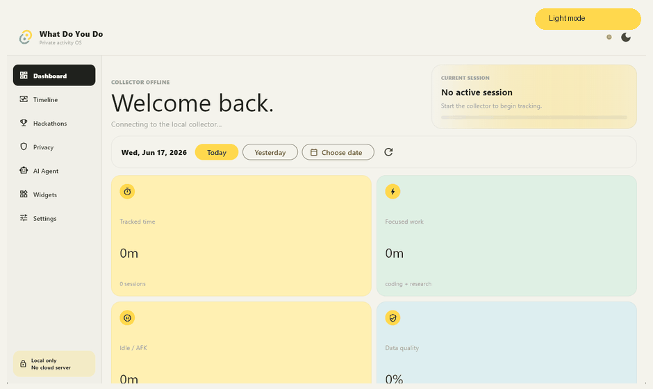
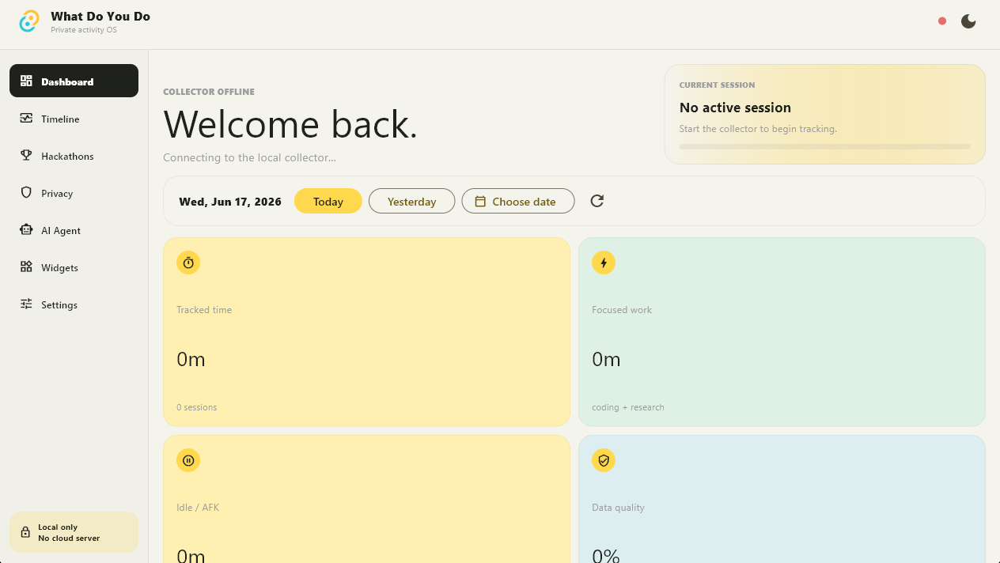
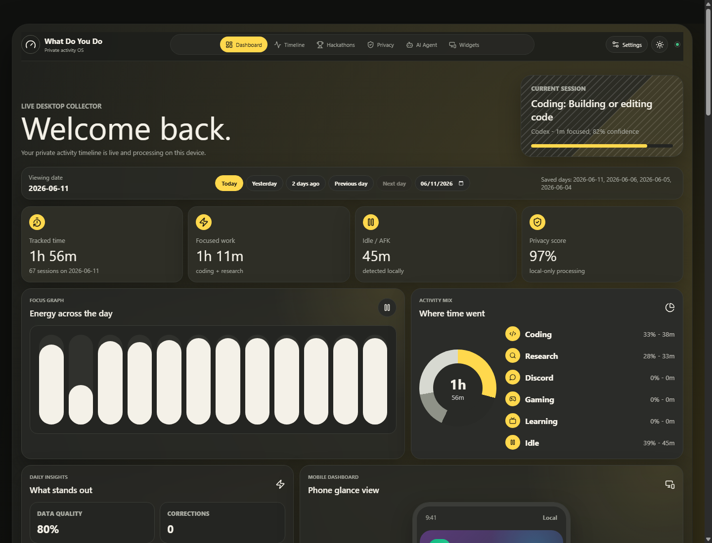
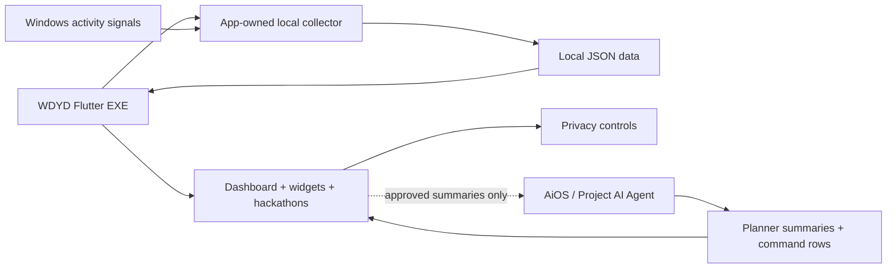

# What Do You Do

<p align="center">
  
</p>

<p align="center">
  <b>A cute local-first activity dashboard that answers the question: where did my day go?</b>
</p>

<p align="center">
  
  
  
  
</p>

## Peek

<p align="center">
  
</p>

<table>
  <tr>
    <td></td>
    <td></td>
  </tr>
</table>

## The Vibe

This branch is the installed **Windows-native Flutter app**. It owns its packaged
collector, reads local activity, and talks to AiOS through loopback-only approved
summaries. No Vite server or browser dashboard is required on Windows.

The Linux/browser implementation is preserved on the
[`linux-browser`](https://github.com/AnuranjanJain/what-do-you-do/tree/linux-browser)
branch.

| App | Job |
| --- | --- |
| **What Do You Do** | Observes activity and explains where the day went. |
| **[AiOS Assistant](https://github.com/AnuranjanJain/aios-assistant)** | Connects mail, projects and memory, then plans what should happen next. |

WDYD v2 keeps the boundary clean:

- **AiOS owns Email Intelligence**: Gmail OAuth, encrypted tokens, local email sync, Ollama analysis, semantic search, and daily/weekly planning.
- **AiOS owns Command Planner rows**: hackathons, repo work, email tasks, learning videos, goals, work done, work left, and next questions.
- **WDYD displays the result**: planner cards, today/week/month command rows, urgent email counts, deadlines, waiting-for, suggestions, and focus summaries.
- **Applications stay deduplicated**: AiOS classifies the latest 500 emails combined across enabled accounts, groups company timelines, and shares only approved funnel statistics and summaries with WDYD.

## How It Works



No screenshots, keystrokes, private messages, raw browser history, or full notes are sent to the agent. The bridge shares only approved summaries.

## Platform Branches

| Branch | Product surface |
| --- | --- |
| `windows-native` | Installed Flutter desktop app with app-owned local services |
| `linux-browser` | React/Vite browser dashboard and Linux collector workflow |

## Install It On Windows

```powershell
cd flutter_app
C:\Users\anura\development\flutter\bin\flutter.bat build windows --release
powershell.exe -NoProfile -ExecutionPolicy Bypass -File .\windows\install\install.ps1
```

After install, Windows Search should find **What Do You Do** from the Start Menu shortcut.

Launch the installed app directly. Do not run `npm run dev` or keep a browser
window open. Google/email intelligence remains owned by the installed AiOS app.

In **Settings**, Windows users can enable:

- launch the app at sign-in
- open the app in the background tray at sign-in
- run native activity collection inside the app process
- hide the window to the tray or fully exit the app

For Windows development:

```powershell
cd flutter_app
C:\Users\anura\development\flutter\bin\flutter.bat run -d windows
```

## Project Map

```text
.
|-- flutter_app/              Windows native Flutter app
|   |-- lib/src/               app shell, controller, APIs, models, theme
|   |-- test/                  layout, summary, parsing, settings tests
|   `-- windows/install/       local Windows install + uninstall scripts
|-- scripts/                  Linux/browser collector retained for its branch
|-- data/                     local-only session, sync, and hackathon data
|-- docs/screenshots/         README screenshots and GIF previews
`-- projects/                 architecture notes and build plans
```

## Native Data And AiOS API

The Windows app collects activity in-process through Win32 APIs and persists
daily JSON under `%LOCALAPPDATA%\What Do You Do\data`. It does not start Node,
PowerShell polling, Vite, or a WDYD HTTP server.

The Windows client reads `%LOCALAPPDATA%\AiOS Assistant\runtime.json` first. A healthy connection uses one
versioned snapshot request instead of polling every feature separately.

```text
GET /api/local/pairing
GET /api/wdyd/snapshot
GET /api/intelligence/today
GET /api/intelligence/search?q=internship
```

WDYD keeps a privacy-filtered last-good snapshot under its own local app-data
folder. During an AiOS restart, real planner, application, PAT, reminder and
project summaries stay visible with a clear reconnecting state. Live polling
retries every 3 seconds while reconnecting and settles to 15 seconds when
healthy. Raw email bodies, OAuth tokens and private credentials are never cached
by WDYD.

The Linux/browser collector stores a per-install token in the local data folder
and requires it for every activity or hackathon request. If the collector or
AiOS is offline, WDYD shows an empty real-data state; it never fabricates
sessions to make the dashboard look busy.

## Privacy Promise

Raw activity stays on device by default. The app is designed around boring-but-good rules: loopback APIs, local JSON storage, visible sync controls, and agent features that unlock only when the companion desktop agent is installed and paired.

More detail lives in [SECURITY.md](SECURITY.md), [projects/architecture.md](projects/architecture.md), and [projects/flutter-migration.md](projects/flutter-migration.md).
