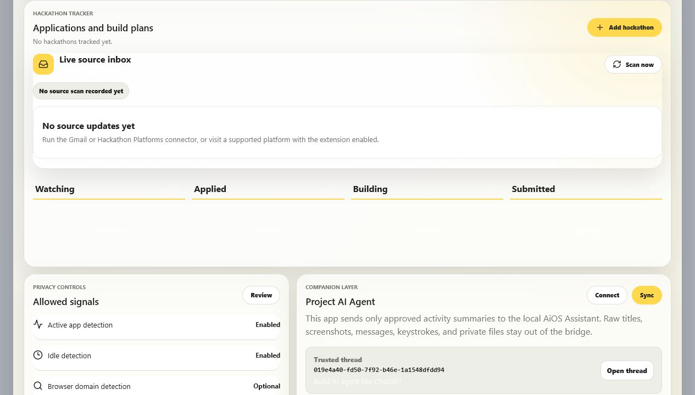

# What Do You Do

Initial build for a privacy-first digital wellbeing app that understands what the user actually did across PC and mobile.

## Current MVP

- React + Vite dashboard
- Typed local activity/session models
- Simulated local activity timeline
- Computed dashboard metrics and activity summaries
- Privacy controls surface
- Project AI Agent integration gate
- Live AiOS Assistant bridge for local wellbeing activity sync
- Local hackathon tracker with application dates, deadlines, plans, progress, work logs, and timelines
- Desktop/mobile widget preview
- Dedicated mobile dashboard preview
- Tauri desktop app wrapper
- Local Windows activity collector for foreground app and idle state
- Real local session persistence under `data/`

## Demo

| Hackathon Corner |
| --- |
|  |

The Hackathon Corner is built as a live workspace inside the wellbeing app:

- four-stage board for Watching, Applied, Building, and Submitted
- live AiOS source inbox for Gmail and platform updates
- connector health, unread updates, and manual source scanning
- local plans, progress, work logs, deadlines, and timeline entries

## Commands

```powershell
npm install
npm run dev
npm run collector:dev
npm run build
npm run desktop:dev
npm run desktop:build
```

The desktop commands require Rust/Cargo and Visual Studio Build Tools to be installed on the machine. See [desktop build notes](projects/desktop-build-notes.md).

## AiOS Assistant Bridge

`What Do You Do` can run standalone, but the dashboard now connects to the local AiOS Assistant at `http://127.0.0.1:5000`.

Workflow:

1. Start AiOS Assistant from `C:\Users\anura\Documents\Ai Agent`.
2. Unlock AiOS in the browser if the local PIN is enabled.
3. Start this app and the collector with `npm run dev` and `npm run collector:dev`.
4. Open the `Project AI Agent` panel and press `Connect`.
5. Press `Sync` to send new high-level activity sessions to AiOS.
6. Optionally enable `Auto-sync approved summaries` after the connection is verified.

Bridge controls:

- `AiOS API`: editable local backend URL, stored in browser local storage.
- `Pending sync`: count of local sessions not yet sent to AiOS.
- `Auto-sync approved summaries`: opt-in background sync from the browser while the dashboard is open.
- `Reset sent list`: clears the local duplicate guard so current sessions can be sent again.

Optional background sync from the collector:

```powershell
$env:WDYD_AIOS_SYNC='1'
$env:WDYD_AIOS_URL='http://127.0.0.1:5000'
$env:WDYD_AIOS_API_TOKEN='paste-the-token-from-aios-settings'
npm run collector:dev
```

When enabled, the collector syncs closed sessions in the background and stores duplicate protection in `data/aios-sync-state.json`.

The bridge sends only:

- app name
- broad category
- sub-activity label
- start/end time label
- duration minutes

It does not send screenshots, keystrokes, raw window titles, private messages, browser history, files, or full notes.

## Hackathon Corner

The Hackathon Corner combines:

- a local four-stage board: Watching, Applied, Building, Submitted
- manual plans, progress, work logs, deadlines, and timeline entries
- a live AiOS source inbox for Gmail and platform updates
- unread update controls
- connector health and manual `Scan now`
- one-click addition of discovered hackathons to the local build board

The source inbox polls `GET http://127.0.0.1:5000/api/hackathons` every 30 seconds. AiOS performs the actual Gmail/platform monitoring, keeping credentials and source processing out of the wellbeing UI.

Start the monitor from AiOS `/workers` after configuring Gmail OAuth or `imports/hackathons`.

Each hackathon stores its applied date, deadline, progress percentage, plan, work completed, URL, and dated timeline updates. Data stays local in `data/hackathons.json`.

Local API:

```text
GET  /hackathons
POST /hackathons/save
POST /hackathons/timeline
POST /hackathons/delete
```

## Project Docs

- [Project brief](projects/what-do-you-do.md)
- [Architecture](projects/architecture.md)
- [Local collector notes](projects/local-collector-notes.md)
- [Real data pipeline](projects/real-data-pipeline.md)
