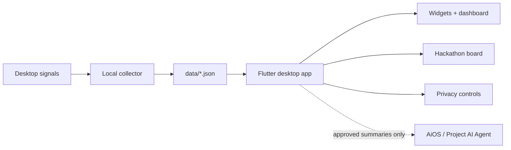

# What Do You Do

<p align="center">
  
</p>

<p align="center">
  <b>A cute local-first activity dashboard that answers the question: where did my day go?</b>
</p>

<p align="center">
  
  
  
</p>

## Peek

<p align="center">
  
</p>

<table>
  <tr>
    <td></td>
    <td></td>
  </tr>
</table>

## The Vibe

`What Do You Do` is a private activity OS for desktop and mobile. It tracks real local signals, groups them into useful context, and turns the messy day into a readable dashboard.

It is built for:

- coding, browsing, watching, gaming, Discord, idle time, notes, and reminders
- hackathon timelines, applied dates, plans, work logs, and source updates
- optional AiOS / Project AI Agent integration after the local agent is installed
- light and dark native Flutter UI with persistent theme choice

## How It Works



No screenshots, keystrokes, private messages, raw browser history, or full notes are sent to the agent. The bridge shares only approved summaries.

## Run It

```powershell
npm install
npm run collector:dev
```

Native desktop:

```powershell
cd flutter_app
C:\Users\anura\development\flutter\bin\flutter.bat run -d windows
```

Build and install the Windows app:

```powershell
cd flutter_app
C:\Users\anura\development\flutter\bin\flutter.bat build windows --release
powershell.exe -NoProfile -ExecutionPolicy Bypass -File .\windows\install\install.ps1
```

After install, Windows Search should find **What Do You Do** from the Start Menu shortcut.

## Project Map

```text
.
├─ flutter_app/              native Flutter desktop/mobile client
│  ├─ lib/src/               app shell, controller, APIs, models, theme
│  ├─ test/                  layout, summary, parsing, settings tests
│  └─ windows/install/       local Windows install + uninstall scripts
├─ src/                      legacy web dashboard kept during migration
├─ scripts/                  local collector and API helpers
├─ data/                     local-only session, sync, and hackathon data
├─ docs/screenshots/         README screenshots and GIF previews
└─ projects/                 architecture notes and build plans
```

## Local APIs

```text
GET  /health
GET  /sessions?date=YYYY-MM-DD
GET  /hackathons
POST /hackathons/save
POST /hackathons/timeline
POST /hackathons/delete
```

AiOS bridge endpoints are discovered through loopback pairing, usually at `http://127.0.0.1:5050`.

```text
GET /api/local/pairing
GET /api/live
GET /api/workers
GET /api/hackathons
GET /api/placements
GET /api/neopat
```

## Privacy Promise

Raw activity stays on device by default. The app is designed around boring-but-good rules: loopback APIs, local JSON storage, visible sync controls, and agent features that unlock only when the companion desktop agent is installed and paired.

More detail lives in [SECURITY.md](SECURITY.md), [projects/architecture.md](projects/architecture.md), and [projects/flutter-migration.md](projects/flutter-migration.md).
