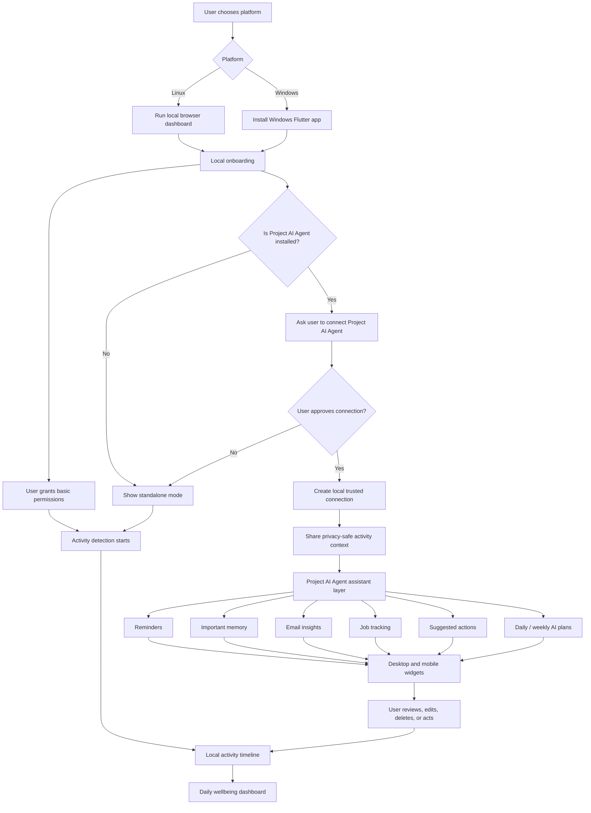
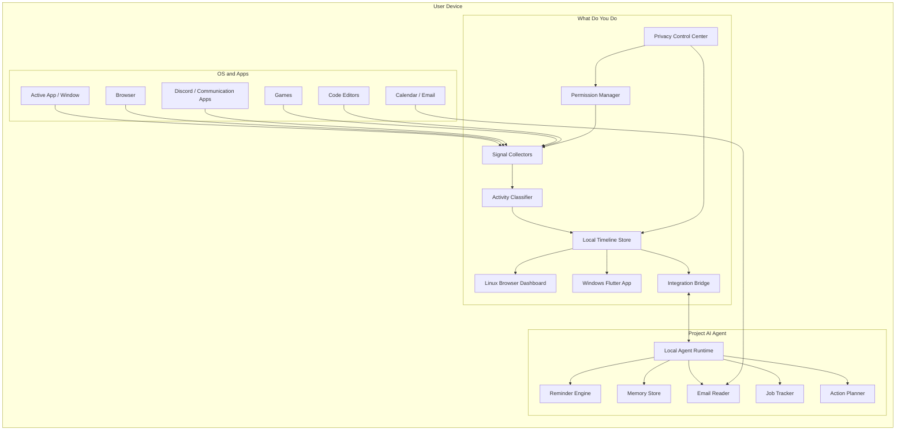
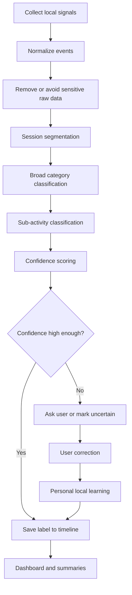
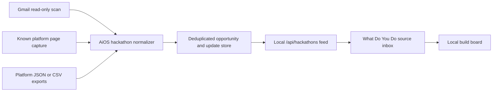
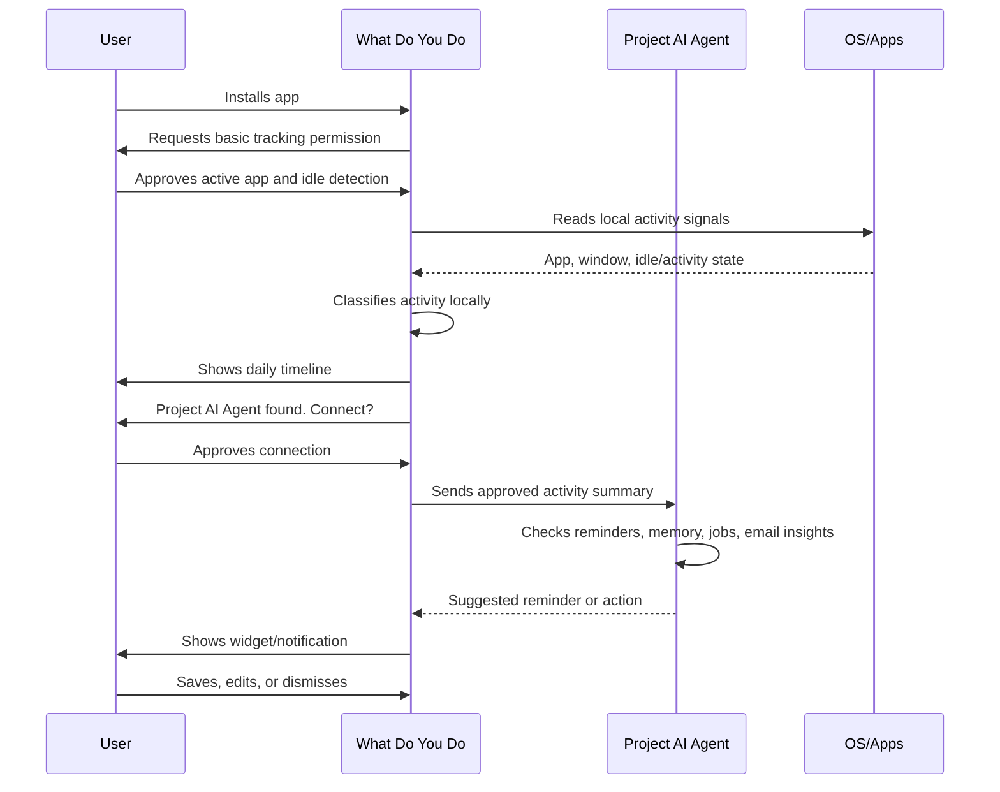

# What Do You Do - System Architecture

## Product split

`What Do You Do` and `Project AI Agent` should be separate but connected apps.

- `What Do You Do`: digital wellbeing, activity detection, time awareness, local timeline, privacy controls.
- `Project AI Agent` / AiOS: reminders, memory, email intelligence, job tracking, automation, assistant actions.

The digital wellbeing app should work by itself. The assistant features should unlock only after `Project AI Agent` is installed and explicitly connected by the user.

For WDYD v2, Gmail/OAuth/AI planning does **not** live inside WDYD. AiOS owns Google accounts, encrypted OAuth tokens, Gmail sync, local Ollama analysis, semantic search, daily plans, weekly plans, smart suggestions, and command-planner rows for hackathons, repos, videos, email tasks, and goals. WDYD consumes only the approved loopback summaries for dashboard cards and the Planner page.

The working product prompt for this real-life planner is saved in `projects/real-life-planner-prompt.md`.

Platform split for v1:

- Linux uses the local React/Vite browser dashboard.
- Windows uses the installed native Flutter desktop app.
- Both clients read from the same local collector/API and local data store.
- Tauri is historical migration reference unless removed in a later cleanup.

## App collaboration flow



## High-level architecture



## Privacy boundary

```mermaid
flowchart TB
    subgraph Private["Private Local Zone"]
        A["Raw signals"]
        B["Window titles"]
        C["Idle/activity data"]
        D["Optional local screenshots"]
        E["Email content, if enabled"]
        F["Local AI processing"]
        G["Local encrypted database"]
    end

    subgraph Shared["Allowed App-to-App Context"]
        H["Activity category"]
        I["Sub-activity label"]
        J["Time blocks"]
        K["User-approved reminder context"]
        L["User-approved job/email summary"]
    end

    subgraph Blocked["Never Shared By Default"]
        M["Raw screenshots"]
        N["Keystrokes"]
        O["Private messages"]
        P["Full browser history"]
        Q["Full mailbox"]
        R["Personal files"]
    end

    A --> F
    B --> F
    C --> F
    D --> F
    E --> F
    F --> G
    F --> H
    F --> I
    F --> J
    G --> K
    G --> L
```



## Activity detection pipeline



## Core modules

### What Do You Do

| Module | Responsibility |
| --- | --- |
| Permission Manager | Handles all user approvals for signals, integrations, screenshots, email hooks, and app connections. |
| Signal Collectors | Reads privacy-safe local signals such as active app, window title, idle state, browser domain, and app state. |
| Activity Classifier | Detects broad activity like coding, browsing, gaming, watching, communication, productivity, and idle. |
| Sub-activity Classifier | Detects deeper labels like debugging, learning, note-making, AFK, strategy gaming, or distracted scrolling. |
| Timeline Store | Stores local time blocks, labels, confidence scores, corrections, and daily summaries. |
| Privacy Control Center | Lets the user pause tracking, inspect collected data, delete data, export data, and disable specific signal sources. |
| Integration Bridge | Connects to `Project AI Agent` only after install detection and explicit user approval, then syncs high-level sessions to the local AiOS API. |
| Dashboard | Shows daily timeline, focus patterns, distractions, active/idle split, app categories, and wellbeing insights. |
| Hackathon Tracker | Stores application dates, deadlines, progress, plans, work logs, and timeline updates in a local JSON file. |
| Widgets | Shows current activity, reminders, focus status, daily summary, and quick capture shortcuts. |

### Project AI Agent

Current trusted Project AI Agent reference:

| Field | Value |
| --- | --- |
| Codex thread | `codex://threads/019e4a40-fd50-7f92-b46e-1a1548dfdd94` |
| Thread title | `Build AI agent like ChatGPT` |
| Local workspace | `C:\Users\anura\Documents\Ai Agent` |
| Expected local app | `http://127.0.0.1:5000/` |

| Module | Responsibility |
| --- | --- |
| Local Agent Runtime | Runs assistant logic locally and receives approved context from `What Do You Do`. |
| Reminder Engine | Creates and triggers reminders by time, app, task, project, email, or job application state. |
| Memory Store | Saves important user-controlled memories, notes, deadlines, people, links, and project context. |
| Email Reader | Reads selected email sources only after opt-in and extracts tasks, deadlines, interviews, and follow-ups. |
| Job Tracker | Tracks applications, statuses, contacts, deadlines, interviews, rejections, offers, and follow-ups. |
| Action Planner | Suggests next actions based on context, reminders, jobs, email, and recent activity. |

## Implemented local bridge

The current bridge is implemented in `src/services/aios.ts` and surfaced in the dashboard `Project AI Agent` panel.

Runtime flow:

1. The dashboard checks `GET http://127.0.0.1:5000/api/live`.
2. If AiOS is locked by the local PIN, the panel reports `locked` and does not pretend sync succeeded.
3. If AiOS is connected, the user can sync new activity sessions manually.
4. The bridge posts each unsent session to `POST http://127.0.0.1:5000/api/wellbeing/activity`.
5. Sent session IDs are remembered in browser local storage to avoid repeated notifications from refreshes.
6. Optional auto-sync can run while the dashboard is open, but it is off until the user enables it.

Dashboard bridge controls:

- Editable AiOS API base URL.
- Pending sync count.
- Last sync time.
- Auto-sync toggle.
- Reset sent-list action for local testing or replays.

Privacy-safe payload:

```json
{
  "source": "what-do-you-do",
  "app_name": "VS Code",
  "category": "deep_work",
  "duration_minutes": 42,
  "planned_task": "Private activity timeline",
  "actual_task": "Building or editing code (09:10-09:52)"
}
```

The bridge intentionally excludes raw window titles, screenshots, keystrokes, URLs, private messages, files, and full private notes.

## Hackathon monitoring flow



The monitor does not store platform passwords or automate login forms. Gmail uses local OAuth credentials, known platform pages are captured by the local extension, and unsupported platform data can be imported through local files.

## Integration contract

`What Do You Do` should not directly become the whole assistant. It should expose approved context to `Project AI Agent`.

Possible local context payload:

```json
{
  "source": "what-do-you-do",
  "timestamp": "local-device-time",
  "activity": {
    "category": "coding",
    "subcategory": "debugging",
    "confidence": 0.82,
    "active_app": "VS Code",
    "project_hint": "what-do-you-do",
    "duration_minutes": 42
  },
  "privacy": {
    "raw_content_included": false,
    "screenshot_included": false,
    "user_approved": true
  }
}
```

Possible agent response:

```json
{
  "source": "project-ai-agent",
  "type": "suggested_action",
  "title": "Save progress note",
  "body": "You spent 42 minutes debugging this project. Save a short note?",
  "actions": ["save_memory", "create_reminder", "dismiss"]
}
```

## Data storage

Use local-first storage.

Recommended stores:

- SQLite for activity timeline, labels, reminders, job tracker rows, and settings.
- Local encrypted vault for sensitive memories, email summaries, and integration tokens.
- File-based exports for user-controlled backups.

Suggested tables:

- `activity_events`
- `activity_sessions`
- `activity_labels`
- `user_corrections`
- `privacy_permissions`
- `connected_apps`
- `reminders`
- `memories`
- `email_insights`
- `job_applications`
- `widget_state`

## Permission model

Use progressive permission prompts.

Base permissions:

- Active app detection
- Idle/activity detection
- Local storage

Optional permissions:

- Browser domain detection
- Discord/app state detection
- Local screenshot understanding
- Email reading
- Calendar reading
- Project AI Agent connection
- Mobile accessibility APIs
- Notification/reminder permissions
- Widget permissions

Every permission should include:

- What is collected
- Why it is needed
- Whether raw content is stored
- How to disable it
- How to delete data collected from it

## MVP architecture

The first MVP should be local-only with two platform surfaces.

MVP scope:

- Linux browser dashboard
- Windows installed Flutter app
- Active app and window tracking
- Idle detection
- Basic activity categories
- Local timeline storage
- Daily dashboard
- Manual label correction
- Privacy controls
- Project AI Agent install detection
- Integration bridge stub

Phase 2:

- Sub-activity classifier
- Discord/app-specific detection
- Widgets
- Reminder integration through Project AI Agent
- Memory integration through Project AI Agent

Phase 3:

- Email reading
- Job tracker
- Mobile companion app
- Mobile widgets
- Optional encrypted sync
- Personal local learning from corrections

## Example user journey



## System rules

- Local-first by default.
- No server required for core features.
- No raw private content leaves the device by default.
- No keystroke logging.
- No private message reading by default.
- No full mailbox scanning by default.
- User can pause tracking instantly.
- User can delete all local data.
- User can inspect what signals are enabled.
- User can use `What Do You Do` without `Project AI Agent`.
- Assistant features require `Project AI Agent` installed and connected.
