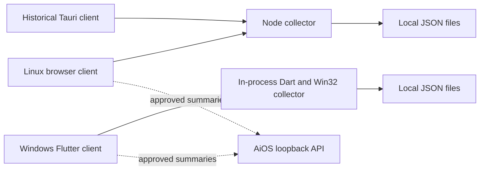

# What Do You Do - Engineering Audit

Audit date: 2026-08-07  
Branch: `windows-native`  
Audited commit: `3048213` (`Refine hackathon college and theme experience`)

## Executive Summary

What Do You Do is a local-first, single-user activity intelligence product with two
client surfaces:

The repository builds successfully and the Flutter test suite is green. It is not
production-ready yet because the runtime paths have diverged, the legacy collector
has no real local authentication, plaintext files are used for sensitive local
records, and the browser silently replaces failed real data with simulated data.
Those are data integrity and privacy risks, not cosmetic issues.

### Overall verdict

**No-go for a public production release.** The Windows Flutter path is the intended
release path, but the release boundary is not yet clean enough to guarantee that the
installed app is the only collector, that activity cannot be read by another local
process, or that a collector outage cannot be mistaken for real activity.

### Key strengths

- Windows native app has an in-process collector and a local daily data model.
- AiOS integration is deliberately loopback-only and summary-oriented.
- External URLs are protocol-filtered and opened with `rel="noreferrer"`.
- Flutter analyzer, Flutter tests, Rust check, Rust clippy, JavaScript syntax check,
  and the production web build pass.
- User data directories and build output are ignored by Git.

### Key risks

- Collector HTTP endpoints accept requests without an authentication token.
- The Linux/legacy Node collector and Windows native collector are separate engines.
- The browser fallback generates activity after any collector error.
- Writes are direct JSON writes with no per-file lock or atomic replace.
- The shipped React surface contains a developer-specific AiOS path and thread ID.
- No CI workflow, React test script, collector integration suite, or installed-app
  end-to-end test is present.

## Evidence Collected

| Check | Result |
| --- | --- |
| `npm run build` | Pass; TypeScript and Vite build completed, 1,586 modules transformed |
| `flutter analyze` | Pass; no issues found |
| `flutter test` | Pass; 26 tests passed |
| `cargo check` | Pass |
| `cargo clippy -- -D warnings` | Pass |
| `node --check scripts/collector/local-activity-collector.mjs` | Pass |
| `npm audit --omit=dev --audit-level=high` | Fails the gate; 2 high, 1 low findings reported |
| CI workflow inventory | No `.github` directory found |
| Browser smoke probe | App rendered; collector unavailable produced simulator mode; mobile viewport showed clipped horizontal content |
| Sensitive-file inventory | No tracked `.env`, credential, token, database, or secret file found |

## Surface Coverage

| Surface | Current implementation | Audit conclusion |
| --- | --- | --- |
| React frontend | `src/main.tsx`, `src/styles.css`, `src/services/` | Functional dashboard, but monolithic and simulator fallback is unsafe |
| Flutter frontend | `flutter_app/lib/src/shell.dart` and controller | Intended Windows surface; native UI checks pass |
| Backend/API | Node HTTP collector plus loopback AiOS bridge | No server-side auth boundary; response contracts need validation |
| Database | Daily JSON files under local data directories | Prototype storage only; no schema migrations, transactions, indexes, or encryption |
| Workers | Node `setInterval`, Flutter `Timer.periodic`, React polling effects | Asynchronous jobs can overlap; no durable queue or backoff policy |
| Authentication | AiOS pairing token in native bridge; collector Origin check | AiOS boundary is stronger, collector is unauthenticated without a required token |
| Gmail/email | Not implemented in WDYD; owned by AiOS | Correct boundary, but requires versioned contract and fixture tests |
| GitHub/planner | Not implemented in WDYD; displayed through AiOS summaries | Dependency must be treated as optional/stale/locked explicitly |
| Notifications | No WDYD notification worker reviewed | Not a current WDYD capability; do not imply it is implemented |
| Packaging | Flutter installer scripts, historical Tauri config | Windows install works as a script path but startup/legacy story is inconsistent |
| Documentation | Root README, Flutter README, projects docs, SECURITY | Root is useful; platform/runtime instructions conflict in places |
| Folder/naming | `src`, `flutter_app`, `scripts`, `src-tauri`, `projects` | Understandable, but legacy ownership is not encoded in the tree |

## Data and API Model Assessment

There is no relational database or migration system in WDYD. The effective schema is
the shape of daily session JSON, hackathon JSON, sync state, and AiOS snapshot
envelopes. This is reasonable for a single-user prototype but does not provide
transactions, indexes, concurrent-writer protection, encryption, or query scalability.

The local HTTP API exposes health, activity, dates, sessions, correction, note, and
hackathon routes. The AiOS bridge exposes local status, PAT, feed, and summary calls
through separate discovery paths. The API surface has useful input limits and
loopback URL restrictions, but it needs authentication, schema validation, version
negotiation, timeout/cancellation, and idempotency before it can be treated as a
stable service contract.

## Worker and Integration Assessment

There is no durable background-job system. Timers are the worker mechanism for
capture, persistence, AiOS sync, and feed refresh. They have no queue visibility,
retry budget, dead-letter state, or single-flight guarantee. Gmail, GitHub, Ollama,
and planner intelligence belong to AiOS, so WDYD should only consume a versioned
approved-summary contract and clearly show unavailable/stale states when that
companion is absent.

## Findings

Severity and priority use the following scale: Critical/P0 blocks release, High/P1
requires resolution before a trusted beta, Medium/P2 should be scheduled, and
Low/P3 is cleanup.

### C-01 - Real collector failures become synthetic activity

- Problem: `src/main.tsx:187-217` initializes sessions with `simulateTodayActivity()`
  and calls the same function whenever `fetchLiveSessions` fails.
- Impact: A stopped collector, malformed response, permission failure, or API outage
  can render plausible activity cards instead of an empty/error state. The UI labels
  simulator mode, but the totals, timeline, focus graph, and cards still look like
  a normal day.
- Affected files: `src/main.tsx:187-217`, `src/main.tsx:701-750`,
  `src/main.tsx:1200-1217`.
- Root cause: Demo fallback is part of the production data path instead of an
  explicit demo-mode boundary.
- Risk: Incorrect wellbeing decisions and false trust in collected data.
- Suggested fix: Default to no data on failure, preserve last-known real data with a
  stale marker, and put simulation behind an explicit developer/demo switch.
- Complexity: Medium.
- Priority: Critical/P0.

### C-02 - Loopback collector has no request authentication

- Problem: `scripts/collector/local-activity-collector.mjs:825-841` rejects a bad
  `Origin` only when the header is present. Requests without `Origin` continue to
  `/sessions`, `/activity`, and mutation routes. The routes are implemented at
  `scripts/collector/local-activity-collector.mjs:846-995`.
- Impact: Any local process can read activity, notes, corrections, and hackathon
  data, or mutate those records. Loopback limits network exposure but does not
  distinguish the user app from another local process.
- Affected files: `scripts/collector/local-activity-collector.mjs:825-995`,
  `src/services/collector.ts`, `src/services/hackathons.ts`,
  `src-tauri/src/lib.rs:12-14`.
- Root cause: Origin validation is being used as an authentication boundary.
- Risk: Local malware, a malicious localhost page, or an unrelated process can
  exfiltrate or alter private activity data.
- Suggested fix: Generate a per-install secret, store it in an OS-protected vault,
  require a constant-time `Authorization` token on every route, and use a random
  port or native IPC for the Windows client.
- Complexity: Medium.
- Priority: Critical/P0.

### C-03 - Multiple collector architectures are simultaneously present

- Problem: The README says Windows is in-process Flutter, while the repository still
  contains the Node/PowerShell collector, a Tauri launcher, and a startup PowerShell
  launcher. The Flutter collector is implemented in
  `flutter_app/lib/src/collector_api.dart:29-75`; Tauri starts Node at
  `src-tauri/src/lib.rs:74-135`.
- Impact: Classification, persistence format, startup behavior, privacy behavior,
  and test coverage differ by launch surface. A user can run the wrong engine and
  still see a plausible dashboard.
- Affected files: `README.md`, `flutter_app/lib/src/collector_api.dart`,
  `scripts/collector/local-activity-collector.mjs`, `src-tauri/src/lib.rs`,
  `flutter_app/windows/install/start-collector.ps1`.
- Root cause: Migration left legacy runtime code in the active repository and docs.
- Risk: Release artifact drift and untestable combinations.
- Suggested fix: Declare Flutter Windows canonical, remove legacy collector startup
  from the Windows release, isolate Tauri as historical, and retain the Node path
  only on the Linux branch with branch-specific CI.
- Complexity: High.
- Priority: Critical/P0.

### H-01 - Sampling can overlap and race persistence

- Problem: The Node collector calls `execFile` every `pollMs` at
  `scripts/collector/local-activity-collector.mjs:515-537` and starts the timer at
  line 1012. There is no in-flight guard; PowerShell can run longer than the 2.5
  second interval.
- Impact: Concurrent callbacks can update `currentSession` and `sessions` out of
  order, overwrite a newer record with an older snapshot, and trigger simultaneous
  file writes.
- Affected files: `scripts/collector/local-activity-collector.mjs:515-537`,
  `scripts/collector/local-activity-collector.mjs:247-259`, `:1010-1012`.
- Root cause: Fixed-rate scheduling is used for an asynchronous capture operation.
- Risk: Lost time, duplicate transitions, corrupted or stale daily records.
- Suggested fix: Use a single-flight loop or mutex, record capture duration, and skip
  or coalesce ticks while a capture is pending.
- Complexity: Low to medium.
- Priority: High/P1.

### H-02 - Local JSON writes are not atomic or serialized

- Problem: Node writes daily sessions and hackathons directly with `writeFile` at
  `scripts/collector/local-activity-collector.mjs:247-277`. Flutter directly calls
  `writeAsString` at `flutter_app/lib/src/collector_api.dart:253-266`.
- Impact: A process crash or overlapping write can leave truncated JSON. Concurrent
  correction and capture requests can lose each other's changes.
- Affected files: the Node collector persistence functions and
  `flutter_app/lib/src/collector_api.dart:212-266`.
- Root cause: JSON files are treated as a database without atomic temp-file replace,
  locking, revision checks, or transactions.
- Risk: Permanent local data loss and unrecoverable parse failures.
- Suggested fix: Add per-file serialization, write to a same-directory temporary
  file, flush where supported, atomically replace, and retain a bounded backup.
- Complexity: Medium.
- Priority: High/P1.

### H-03 - Shipped React UI contains developer-specific identity data

- Problem: `src/main.tsx:122-127` hardcodes a local path, AiOS port, Codex thread ID,
  and thread URL.
- Impact: Other installations show a path that does not exist, expose a developer
  thread identifier, and may open an unrelated local endpoint.
- Affected files: `src/main.tsx:122-127`, related AiOS bridge UI at `:1079-1093`.
- Root cause: Development pairing data was committed as product configuration.
- Risk: Privacy leakage, broken pairing, and misleading trust UI.
- Suggested fix: Read identity from the runtime pairing descriptor, show a generic
  unpaired state, and store no user path or thread ID in source.
- Complexity: Low to medium.
- Priority: High/P1.

### H-04 - AiOS sync deduplication is browser-local and bounded

- Problem: `src/services/aios.ts:168-221` sends only five sessions per pass, while
  `:242-253` stores only the last 500 sent IDs in `localStorage`.
- Impact: IDs can be forgotten after eviction, browser profile changes, storage
  clearing, or a second client. The same activity can be inserted into AiOS again;
  large backlogs can take a long time to drain.
- Affected files: `src/services/aios.ts:168-253`, AiOS wellbeing ingestion contract.
- Root cause: Idempotency is implemented in a UI storage layer rather than at the
  receiving service boundary.
- Risk: Duplicate wellbeing history and incomplete synchronization.
- Suggested fix: Send a stable source event ID and date, require server-side
  idempotency, batch safely, and persist a durable sync cursor in the canonical
  local store.
- Complexity: Medium.
- Priority: High/P1.

### H-05 - Startup settings reference a retired collector launcher

- Problem: `flutter_app/lib/src/startup_manager.dart:54-142` searches beside the
  executable for `start-collector.ps1`. `flutter_app/windows/install/install.ps1:34-37`
  copies the Flutter release and `uninstall.ps1`, but not `start-collector.ps1` or a
  Node collector bundle. The app itself is now in-process.
- Impact: The collector startup toggle can be unavailable or point at an obsolete
  Node process. The Flutter README still claims this launcher is installed at
  `flutter_app/README.md:39-43`.
- Affected files: startup manager, installer, `start-collector.ps1`, Flutter README.
- Root cause: Startup migration was only partially completed.
- Risk: Broken first-run behavior and two collectors running at once.
- Suggested fix: Remove the collector startup shortcut from Windows, or implement it
  as a supported native service contract with an end-to-end install test.
- Complexity: Medium.
- Priority: High/P1.

### H-06 - Test coverage does not protect the release path

- Problem: `package.json` has no React test, lint, or typecheck-only script. There is
  no `.github` workflow. Flutter tests cover parsing and widget states but not the
  packaged Windows executable, Win32 activity channel, tray/close lifecycle,
  installer, startup shortcut, or real AiOS pairing.
- Impact: The exact user path that determines production reliability is untested.
- Affected files: `package.json`, `flutter_app/test/`, installer scripts, Windows
  runner code.
- Root cause: Unit/widget checks grew around UI behavior without a release test
  harness.
- Risk: Regressions can ship despite green local checks.
- Suggested fix: Add CI build gates, React unit tests, collector integration tests,
  Windows smoke tests, installer tests, and a loopback AiOS contract fixture.
- Complexity: High.
- Priority: High/P1.

### H-07 - Sensitive data is stored as plaintext JSON

- Problem: `SECURITY.md` explicitly states that activity sessions, notes, hackathon
  plans, and sync state are unencrypted. The file-backed implementations are in the
  Node collector and `flutter_app/lib/src/collector_api.dart`.
- Impact: Anyone with access to the Windows account, backup, or data directory can
  read private activity history and notes.
- Affected files: `SECURITY.md:20-25`, collector persistence code, local app-data
  storage.
- Root cause: Encryption was deferred while the privacy promise remained active.
- Risk: The current privacy positioning overstates protection at rest.
- Suggested fix: Protect keys with Windows DPAPI/credential vault, encrypt sensitive
  records, document recovery/export, and ensure backups do not expose plaintext.
- Complexity: High.
- Priority: High/P1.

### H-08 - API response shape is trusted without runtime validation

- Problem: React services cast `response.json()` directly, for example
  `src/services/collector.ts:33` and `src/services/hackathons.ts:20,96,140,156`.
  Fetch calls in the React path also lack an abort timeout.
- Impact: A malformed, stale, or unexpected local response can produce undefined
  fields, partial UI state, or a stuck request.
- Affected files: `src/services/collector.ts`, `src/services/hackathons.ts`,
  `src/services/aios.ts`, `src/main.tsx` polling effects.
- Root cause: TypeScript compile-time types are being treated as runtime schemas.
- Risk: Silent data corruption and poor recovery during version skew.
- Suggested fix: Add schema validation, version negotiation, request timeouts, and
  structured error states.
- Complexity: Medium.
- Priority: High/P1.

### M-01 - The primary React surface is too monolithic

- Problem: `src/main.tsx` contains the application shell, route state, polling,
  data orchestration, dashboard, timeline, hackathon board, PAT view, AiOS bridge,
  and settings. `src/styles.css` is also a very large global stylesheet; Flutter
  presentation is concentrated in `flutter_app/lib/src/shell.dart`.
- Impact: Small changes have a wide regression surface and are hard to review or
  test in isolation.
- Root cause: Features were added directly to the top-level shell.
- Risk: Slow delivery and accidental cross-feature coupling.
- Suggested fix: Split by feature, move data hooks/services out of render files, and
  introduce shared domain contracts.
- Complexity: High.
- Priority: Medium/P2.

### M-02 - Mobile targets are scaffolding, not a functioning collector

- Problem: `flutter_app/lib/src/collector_api.dart:29-36` defaults to the Windows
  method channel on every platform, while the README says Android and iOS are future
  targets.
- Impact: Mobile builds may render the shell but cannot collect the Windows signal
  set or present a complete permission model.
- Root cause: Shared Flutter UI was created before platform-specific collectors.
- Risk: Users infer mobile support that does not exist.
- Suggested fix: Mark mobile as unavailable in product metadata, or implement an
  explicit mobile signal adapter and permissions flow before release claims.
- Complexity: High.
- Priority: Medium/P2.

### M-03 - Legacy documentation contradicts the chosen Windows architecture

- Problem: `flutter_app/README.md:15-19` instructs users to run `npm run collector:dev`
  even though the Windows app owns an in-process collector. The same document says
  the installer adds `start-collector.ps1`, which the current installer does not copy.
- Impact: Developers and users can start obsolete services and misdiagnose offline
  behavior.
- Root cause: Migration documentation was not fully reconciled after the native move.
- Risk: Support burden and duplicate runtime processes.
- Suggested fix: Make the Windows README describe only the Flutter path; move Linux
  collector instructions to the Linux/browser documentation.
- Complexity: Low.
- Priority: Medium/P2.

### M-04 - Performance is polling- and file-write-heavy without measurement

- Problem: React polls live sessions every three seconds and several AiOS feeds every
  30 seconds. Flutter captures every 2.5 seconds and rewrites a daily JSON file.
- Impact: CPU, disk, and battery costs are unknown and can increase with larger daily
  histories.
- Root cause: Fixed polling was chosen before profiling.
- Risk: Poor laptop battery life and degraded responsiveness over long sessions.
- Suggested fix: Instrument startup, capture, serialization, UI commit, and bridge
  latency; then use event-driven updates or adaptive intervals.
- Complexity: Medium.
- Priority: Medium/P2.

### L-01 - Version and package metadata are inconsistent

- Problem: Root `package.json` is version `0.1.0`, while Flutter `pubspec.yaml` is
  version `1.0.1+2` and the installer uses `1.0.1`.
- Impact: Release notes, support diagnostics, and update detection can identify the
  same product differently.
- Root cause: Separate packaging tracks do not share a version source.
- Risk: Low operational confusion.
- Suggested fix: Define one release version and generate platform metadata from it.
- Complexity: Low.
- Priority: Low/P3.

### L-02 - Dependency freshness and advisory policy are not automated

- Problem: `flutter pub outdated` reports direct and transitive updates, and npm
  audit reports vulnerable Vite/PostCSS ranges. No dependency update or audit gate
  exists.
- Impact: Known fixes can remain pending unnoticed.
- Root cause: No scheduled dependency maintenance workflow.
- Risk: Accumulating security and compatibility debt.
- Suggested fix: Add a scheduled audit, lockfile review, and an explicit exception
  policy for development-only vulnerabilities.
- Complexity: Low to medium.
- Priority: Low/P3.

## Architecture Assessment

The product boundary is conceptually sound: WDYD owns activity awareness and AiOS
owns deeper email/planner intelligence. The implementation is not yet a single
architecture because the Linux Node collector, historical Tauri wrapper, and Windows
Flutter collector each remain discoverable. The Windows release should have one
canonical path and one versioned local data contract.

The local JSON approach is suitable for a single-user prototype and small personal
history. It is not a multi-user or large-scale database: there are no transactions,
indexes, migrations, encryption, conflict resolution, or concurrent writer strategy.

## Companion AiOS Dependency Audit

WDYD delegates email, GitHub, local-model reasoning, planning, and the richer
dashboard summaries to `C:\Users\anura\Documents\Ai Agent`. That repository was
reviewed read-only for this audit and currently has uncommitted application changes;
its behavior must therefore be treated as a release dependency, not as an assumed
trusted service.

### H-09 - AiOS discovery can trust an impersonated loopback service

- Problem: `src/services/aios.ts:74-132` accepts a loopback `/api/live` response as
  AiOS identity, while `flutter_app/lib/src/agent_desktop_api.dart:196-264,413-419`
  probes candidate ports and trusts a service-provided token/descriptor.
- Impact: Another local process can impersonate AiOS, receive activity summaries, or
  influence planner/opportunity data. Loopback is reachability, not identity.
- Affected files: WDYD AiOS bridge and native discovery; AiOS `app/routes.py:2217-2232`
  and `app/services/api_auth.py:6-12`.
- Root cause: Port discovery and self-reported service metadata are being used as a
  pairing protocol.
- Risk: High privacy disclosure and confused-deputy risk.
- Suggested fix: Use one authenticated pairing handshake with a per-install secret
  stored in the OS credential vault, a service identity/version, constant-time token
  checks, and rejection of empty-token pairing.
- Complexity: Medium. Priority: P1.

### H-10 - AiOS health can report success after capture failure

- Problem: `flutter_app/lib/src/collector_api.dart:85-95` returns `ok: true` even
  when `_lastError` is populated, and `flutter_app/lib/src/app_controller.dart:84-106`
  treats that response as an online collector.
- Impact: The native dashboard can show an online/no-data state after capture has
  failed, delaying recovery and making freshness misleading.
- Affected files: AiOS native collector API and controller.
- Root cause: Transport reachability and capture health are represented by one
  boolean.
- Risk: High stale-data and trust risk.
- Suggested fix: Expose `transport`, `capture`, `last_success_at`, `last_error`, and
  freshness separately; render stale/offline state from capture health.
- Complexity: Low to medium. Priority: P1.

### H-11 - AiOS session durations are inflated by a one-minute minimum

- Problem: The Node/Flutter collectors create new sessions with `durationMinutes: 1`
  and later clamp elapsed durations with `Math.max(1, ...)` or equivalent.
- Impact: Rapid app switches and short windows overcount activity, corrupting focus
  and wellbeing totals.
- Affected files: WDYD collector paths and AiOS native collector API.
- Root cause: A display-friendly minimum was applied to stored duration rather than
  only to rendering.
- Risk: High analytics integrity risk for short sessions.
- Suggested fix: Persist exact seconds or zero/rounded seconds, then apply a minimum
  only when rendering a human-readable label.
- Complexity: Low to medium. Priority: P1.

### H-12 - AiOS Google sign-in is not self-contained for a clean install

- Problem: `app/services/email_intelligence.py:128-223` requires
  `google_client_secret.json` from a configured or runtime credentials directory
  before starting OAuth. The OAuth job itself is held in the in-memory `_JOBS` map
  at `app/services/oauth_sign_in.py:7-119`.
- Impact: A clean install cannot complete the advertised one-click Gmail setup
  without an out-of-band client-secret file, and an app restart loses an in-flight
  sign-in job.
- Affected files: AiOS Gmail OAuth service, runtime packaging, sign-in UI.
- Root cause: Desktop OAuth provisioning and job persistence were left outside the
  release artifact.
- Risk: High onboarding failure and support risk.
- Suggested fix: Ship a reviewed public desktop OAuth client configuration or a
  documented secure provisioning flow, persist only resumable job metadata, and add
  access-blocked/cancelled/restart tests.
- Complexity: Medium. Priority: P1.

### H-13 - AiOS GitHub intelligence is first-page sampling, not full synchronization

- Problem: `app/services/github_intelligence.py:103-114` requests fixed `per_page`
  values for commits, PRs, issues, branches, releases, workflows, contributors,
  and only the first ten GraphQL discussions. There is no pagination or webhook
  cursor.
- Impact: Repository summaries, completion estimates, inactive-project detection,
  and suggested next tasks can omit older or newly changed records.
- Affected files: AiOS GitHub intelligence service and repository models.
- Root cause: Snapshot fetching was implemented as a bounded dashboard sample.
- Risk: High false progress and missed-work risk for active repositories.
- Suggested fix: Add authenticated incremental cursors/webhooks, pagination with
  rate-limit/backoff handling, and freshness/coverage fields in every summary.
- Complexity: High. Priority: P1.

### H-14 - AiOS workers have no durable retry or failure state

- Problem: `email_intelligence_worker.py`, `hackathon_monitor_worker.py`,
  `local_worker.py`, and `watch_import_worker.py` run unguarded infinite loops;
  a raised exception exits the worker. `app/services/workers.py:58-189` writes
  state directly and has no durable job queue, retry budget, or dead-letter state.
- Impact: Gmail sync, opportunity scans, notifications, and imports can silently
  stop after one malformed setting, network error, or provider exception.
- Affected files: AiOS worker scripts and worker manager.
- Root cause: Background work is modeled as unmanaged processes plus timers.
- Risk: High silent-data-staleness risk.
- Suggested fix: Add supervised jobs with structured run records, exponential
  backoff, bounded retries, durable cursors, crash recovery, and visible last-error
  state; make state writes atomic.
- Complexity: High. Priority: P1.

### M-05 - AiOS architecture documentation overstates storage and AI capabilities

- Problem: WDYD `projects/architecture.md:125-137,314-336` describes a local
  encrypted database/SQLite design, while WDYD currently uses JSON and the AiOS
  companion uses SQLite plus ad-hoc migrations and a derived Fernet key.
- Impact: Security reviewers, maintainers, and users cannot tell which guarantees
  exist in the shipped build.
- Affected files: WDYD architecture docs, `SECURITY.md`, AiOS models and startup.
- Root cause: Target architecture and current implementation were documented
  together without a current-state boundary.
- Risk: Medium misconfiguration and false-assurance risk.
- Suggested fix: Separate Current State, Target State, and Release Guarantees in all
  docs; link each claim to a tested implementation.
- Complexity: Low. Priority: P2.

### M-06 - AiOS local search and planning are narrower than product claims

- Problem: `app/services/email_intelligence.py:1385-1394` searches only lexical terms
  over the newest 300 messages; it is not semantic/vector search. The planner also
  has fixed work windows and does not fully model calendar conflicts, time zones, or
  long-range dependencies.
- Impact: Questions can miss older relevant mail, and generated schedules can be
  incorrect around timezone-aware calendar events or duplicate titles.
- Affected files: AiOS email intelligence, vector-store integration, and planning
  engine.
- Root cause: Product claims advanced graph/search/planning behavior before the
  retrieval and scheduling contracts are complete.
- Risk: Medium misleading-answer and overbooking risk.
- Suggested fix: Make retrieval coverage explicit, add indexed embeddings with
  fallback labels, preserve timezone conversions, and add conflict/dependency evals.
- Complexity: High. Priority: P2.

## Release Decision

Do not publish a trusted public Windows release until C-01, C-02, C-03, H-01, H-02,
H-03, H-05, H-06, H-07, H-09, H-10, H-11, H-12, H-13, and H-14 have acceptance tests.
The detailed gate is in
[`RELEASE_BLOCKERS.md`](RELEASE_BLOCKERS.md), and the proposed order of work is in
[`REFACTORING_ROADMAP.md`](REFACTORING_ROADMAP.md).
