# Real Data Pipeline

This app should not depend on fake data. The fake simulator is only a fallback for UI development.

## Pipeline overview

```mermaid
flowchart LR
    A["Windows OS signals"] --> B["Local collector"]
    B --> C["Privacy filter"]
    C --> D["Normalizer"]
    D --> E["Classifier"]
    E --> F["Sessionizer"]
    F --> G["Local store"]
    G --> H["Local API"]
    H --> I["Dashboard"]
    I --> J["AiOS bridge"]
    J --> K["Local assistant context"]
```



## Stage 1: OS signals

The first real Windows collector uses:

- Foreground window handle
- Foreground process id
- Process name
- Window title summary
- Last input time for idle detection
- Local timestamp

It does not use:

- Screenshots
- Keystrokes
- Message contents
- Browser page contents
- File contents

## Stage 2: Privacy filter

The collector should only expose and persist high-level metadata.

Allowed:

- App name
- Activity category
- Sub-activity label
- Start/end time
- Duration
- Confidence
- Signal source

Avoid storing by default:

- Full raw window titles
- URLs
- Private message text
- Screenshots
- Clipboard
- Keystrokes

## Stage 3: Normalizer

Raw Windows data becomes a normalized snapshot:

```json
{
  "appName": "Chrome",
  "category": "browsing",
  "subcategory": "Research or documentation",
  "confidence": 70,
  "idle": false,
  "rawContentStored": false
}
```

## Stage 4: Classifier

The current classifier is rule-based.

Examples:

- `Code`, `Cursor`, `PowerShell` -> coding
- `Discord`, `Teams`, `Slack`, `Zoom` -> communication
- `Steam`, `Riot`, game launchers -> gaming
- `YouTube`, `VLC`, `Twitch` -> watching
- `Chrome`, `Edge`, `Firefox` -> browsing
- idle threshold exceeded -> idle

Later versions can add on-device AI classification, but the rule layer should stay as the first fast and explainable pass.

## Stage 5: Sessionizer

The sessionizer groups repeated snapshots into sessions.

Example:

```json
{
  "startTime": "20:44",
  "endTime": "20:58",
  "appName": "Chrome",
  "category": "browsing",
  "subcategory": "Browsing or app activity",
  "durationMinutes": 14,
  "confidence": 70
}
```

If the app/category/subcategory changes, the current session closes and a new session starts.

## Stage 6: Local store

Development storage currently uses daily local JSON files under `data/activity-sessions/`.

Example:

```text
data/activity-sessions/2026-06-01.json
data/activity-sessions/2026-06-02.json
```

Planned production storage:

- SQLite for sessions, labels, permissions, reminders, and connected apps
- Optional encrypted vault for sensitive assistant data

## Stage 7: Dashboard API

The local collector exposes:

- `GET /health`
- `GET /activity`
- `GET /sessions?date=YYYY-MM-DD`
- `GET /dates`

The dashboard polls `/sessions?date=YYYY-MM-DD`. If the selected date is the active date, the response includes the live current session. If the selected date is older, the response comes from persisted daily history. If the collector is not running, the dashboard falls back to simulator data.

## Stage 8: AiOS local bridge

The dashboard can forward approved session summaries to AiOS Assistant on the same device:

- health/live check: `GET http://127.0.0.1:5000/api/live`
- activity sync: `POST http://127.0.0.1:5000/api/wellbeing/activity`
- duplicate guard: browser local storage tracks session IDs already sent to AiOS
- lock handling: a `401` response means AiOS is running but the local PIN is locked
- auto-sync: optional browser-side sync every 15 seconds while the dashboard is open
- endpoint config: AiOS base URL is editable and saved locally in the browser

The collector can also sync closed sessions without the browser dashboard:

- enable with `WDYD_AIOS_SYNC=1`
- set `WDYD_AIOS_URL=http://127.0.0.1:5000`
- set `WDYD_AIOS_API_TOKEN` to the token configured in AiOS settings
- duplicate guard: `data/aios-sync-state.json`

The bridge is not a cloud sync layer. It is a local app-to-app workflow for assistant context, reminders, and later memory/job/email suggestions.

## Real-data milestone

Current real data:

- Windows foreground app
- Idle state
- Real local session timeline
- Persisted session history
- Daily session files
- Date-aware dashboard view
- Manual and opt-in auto-sync into AiOS Assistant wellbeing events
- Optional token-authenticated collector sync into AiOS Assistant
- Local hackathon workflow persisted in `data/hackathons.json`

Next real data:

- Better browser domain integration through a browser extension or local helper
- Discord high-level state without message reading
- SQLite persistence
- User correction feedback loop
- In-app control for collector-level AiOS sync
